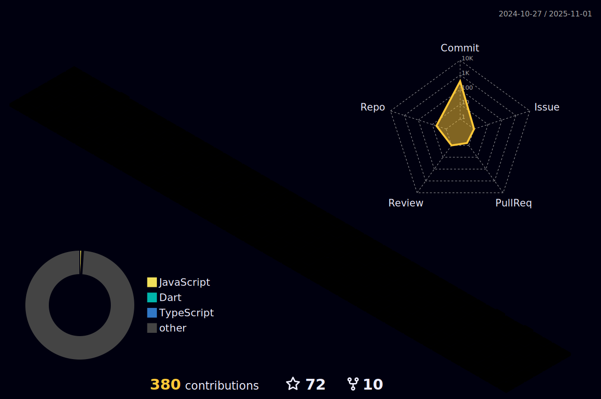

<!--  -->
<!--  -->

  

<h1 align="center">Hi there || नमस्ते  </h1>
<h3 align="center">
IND_CLUTCHERS 💠MODERN DIGITAL 🏠 MALEGAON
</h3>
<h4 align="center">
⚡️ https://getalby.com/p/siddheshkukade
</h5>

Domain | My Expertise
--- | --- 
**Languages**  |     
**Frameworks & Libraries**  |            
**Domain Knownledge**  |    
**CI / CD** |   
**Databases**  |     
**OS**  |   
**Tools & Platform**  |    

 
 

<!-- 
 
 

  

 

 

 

 

  
  

- 📫 How to reach me **siddhesh@siddheshkukade.com**
- 💻 StackOverFlow- [Siddhesh Bhupendra Kukade](https://stackoverflow.com/users/15290971/siddhesh-b-kukade)
- 🤖 Kaggle - [Siddhya](https://www.kaggle.com/siddhya)
  

-->

<!--
<h3 align="center">Connect with me:</h3>

 &nbsp;&nbsp;&nbsp;
&nbsp;&nbsp;&nbsp;&nbsp;

 -->

<!--
<h2 align="center"> ☁ Google Cloud Badges </h2>

<!--  align="left" height="500" width="400"  -->

 
<!--  

 -->
<!-- 

  

  -->
<!-- 
 -->

<!--

 <h2 align="center">Open Source Contributions </h2>

 | Organization / Repository   |      Contributions      |  Links |
|----------|:-------------:|------:|
[PalisadoesFoundation/talawa](https://github.com/PalisadoesFoundation/talawa) |  Pull Request (Under Review)| [ [Google Summer of Code] :  Enabling Plugins , Donation as a Plugin, Refractor for TalawaPluginProvider Widget  ](https://github.com/PalisadoesFoundation/talawa/pull/1355) |
[PalisadoesFoundation/talawa-api](https://github.com/PalisadoesFoundation/talawa-api) |  Pull Request (Under Review )| [ [Google Summer of Code] : Performing Donations ( Ability to store donation transaction in Talwa-api ) ](https://github.com/PalisadoesFoundation/talawa-api/pull/756) |
[PalisadoesFoundation/talawa-api](https://github.com/PalisadoesFoundation/talawa-api) |  Pull Request (Merged)| [ [Google Summer of Code] : Plugin Architecture for Server  ](https://github.com/PalisadoesFoundation/talawa-api/pull/730) |
[PalisadoesFoundation/talawa-admin](https://github.com/PalisadoesFoundation/talawa-admin) |  Pull Request (Merged) | [ [Google Summer of Code] : Plugin Architecture for Admin ](https://github.com/PalisadoesFoundation/talawa-admin/pull/355) |
[PalisadoesFoundation/talawa-admin](https://github.com/PalisadoesFoundation/talawa-admin) |  Pull Request (Merged) | [🐛FIX: [Bug Fix] : Prettier fix ](https://github.com/PalisadoesFoundation/talawa-admin/pull/346) |
[PalisadoesFoundation/talawa-api](https://github.com/PalisadoesFoundation/talawa-api) |  Pull Request (Merged) | [🐛FIX: [Bug Fix] : npm run setup bug ](https://github.com/PalisadoesFoundation/talawa-api/pull/714) |
[PalisadoesFoundation/talawa-api](https://github.com/PalisadoesFoundation/talawa-api) |  Bug Report | [🐛Bug Report : npm run setup compiles with error ](https://github.com/PalisadoesFoundation/talawa-api/issues/712) |
 [PalisadoesFoundation/talawa-api](https://github.com/PalisadoesFoundation/talawa-api) |  Pull Request (Merged) | [🐛FIX: Code Coverage: 🤖 Test for lib/resolvers/group_chat_query/groupChats.jsGroup ](https://github.com/PalisadoesFoundation/talawa-api/pull/710) |
 [PalisadoesFoundation/talawa-admin](https://github.com/PalisadoesFoundation/talawa-admin) |  Pull Request (Merged) | [🐛FIX: Code Coverage: Create tests for rc/state/action-creators/index.ts ](https://github.com/PalisadoesFoundation/talawa-admin/pull/339) |
 [PalisadoesFoundation/talawa-api](https://github.com/PalisadoesFoundation/talawa-api) |  Pull Request (Merged) | [🐛FIX: Code Coverage: Create tests for groupChatMessages.js ](https://github.com/PalisadoesFoundation/talawa-api/pull/709) |
| [PalisadoesFoundation/talawa-admin](https://github.com/PalisadoesFoundation/talawa-admin) |  Pull Request (Merged) | [🐛FIX: Code Coverage: Create tests for plugin.helper.ts](https://github.com/PalisadoesFoundation/talawa-admin/pull/338) |
| [PalisadoesFoundation/talawa-admin](https://github.com/PalisadoesFoundation/talawa-admin) |  Pull Request (Merged) | [🐛FIX: Enabled Scrolling On register page Merged](https://github.com/PalisadoesFoundation/talawa-admin/pull/291) |
| [PalisadoesFoundation/talawa-admin](https://github.com/PalisadoesFoundation/talawa-admin) |  Pull Request (Merged) | [🐛FIX: Code Coverage: Create tests for src/index.ts](https://github.com/PalisadoesFoundation/talawa-admin/pull/296) |
| [PalisadoesFoundation/talawa-admin](https://github.com/PalisadoesFoundation/talawa-admin) |  Pull Request (Merged) | [🐛FIX: Code Coverage: Test plugin reducer](https://github.com/PalisadoesFoundation/talawa-admin/pull/318) |
| [PalisadoesFoundation/talawa-admin](https://github.com/PalisadoesFoundation/talawa-admin) |  Pull Request (Merged) | [🐛FIX: Code Coverage: Test src test store ](https://github.com/PalisadoesFoundation/talawa-admin/pull/310) |
| [PalisadoesFoundation/talawa-admin](https://github.com/PalisadoesFoundation/talawa-admin) |  Pull Request (Merged) | [🐛FIX: Code Coverage: Add test route reducer ](https://github.com/PalisadoesFoundation/talawa-admin/pull/320) |
| [PalisadoesFoundation/talawa-admin](https://github.com/PalisadoesFoundation/talawa-admin) |  Pull Request (Merged) | [🐛FIX: Code Coverage: Testing Render.helper.ts ](https://github.com/PalisadoesFoundation/talawa-admin/pull/321) |
| [PalisadoesFoundation/talawa-admin](https://github.com/PalisadoesFoundation/talawa-admin) |  Bug Report  | [🔍 Can't Scroll in the register page of talawa-admin home page](https://github.com/PalisadoesFoundation/talawa-admin/issues/290) |
| [reduxjs/react-redux](https://github.com/reduxjs/react-redux/) |  Bug Report  | [🔍 Problem with docs in /getting-started section](https://github.com/reduxjs/react-redux/issues/1727) |
-->

<!--  
 # Modern Digital Photo Studio
 

 
 
 ### Hi there || नमस्ते  
- 📫 How to reach me: <siddheshkukade2003@gmail.com> 
- AI ML DS Work: <https://www.kaggle.com/siddhya>
- Web Dev: Here On GitHub

-🌱 I’m currently learning Machine Learning

  

<!-- 
<code></code>
<code></code>
<code></code>
<code></code>
<code></code>
<code></code>
<code></code>
<code></code>
<code></code> -->
<!--  -->
<!--
**SiddheshKukade/SiddheshKukade** is a ✨ _special_ ✨ repository because its `README.md` (this file) appears on your GitHub profile.
🏠
Here are some ideas to get you started:
- 🔭 I’m currently working on ...
- 👯 I’m looking to collaborate on ...
- 🤔 I’m looking for help with ...
- 💬 Ask me about ...
- 📫 How to reach me: ...
- 😄 Pronouns: ...
- ⚡ Fun fact: ...
-->
<!--   Edit this Later-->
<!--  <h1 align="center">Hi 👋, I'm William Lane</h1>
<h3 align="center">A 14 year old developer from Washington State</h3>

  

 

  

- 🔭 I’m currently working on [Crystal](https://crystal-lang.org/), [Haskell](https://www.haskell.org/), and [Rust](http://rust-lang.org/)
## Blog posts
<!-- BLOG-POST-LIST:START -->
<!-- - [Effective Interfaces In Golang](https://dev.to/willdoescode/effective-interfaces-in-golang-3l3n)
- [How to operator overload in Rust.](https://dev.to/willdoescode/how-to-operator-overload-in-rust-33cp) -->
<!-- BLOG-POST-LIST:END -->
<!-- 
<h3 align="left">Connect with me:</h3>

 --> 
